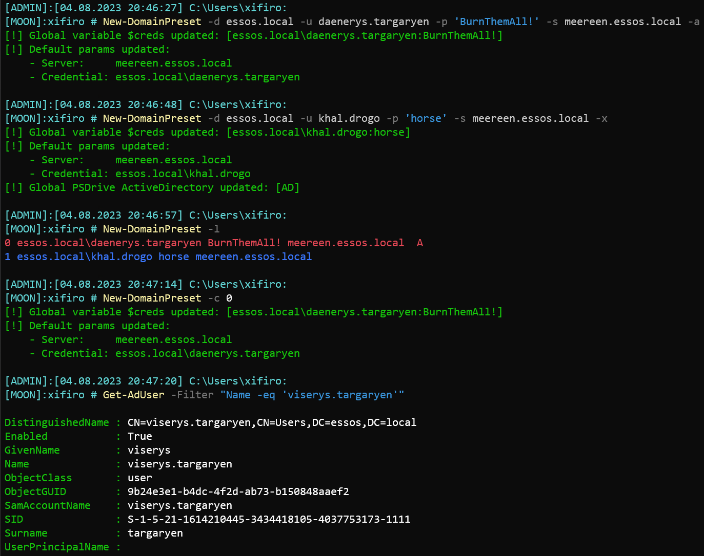

## xrunas
Elementary script run runas or module pth mimikatz
### Usage
```powershell
xrunas -d essos.local -u khal.drogo -H 739120ebc4dd940310bc4bb5c9d37021
```
```powershell
xrunas -d essos.local -u khal.drogo -p horse
```
```powershell
xrunas -d essos.local -u khal.drogo -p horse -r powershell
```
```powershell
xrunas -d essos.local -u khal.drogo -H 739120ebc4dd940310bc4bb5c9d37021 -mpath "C:\Tools\mimikatz.exe"
```
### Help
```b1
-d -- domain
-u -- username
-p -- password
-H -- NT-hash
-m -- path to mimikatz (default:mimikatz.exe)
-r -- run program (default:pwsh)
```
## New-DomainPreset
Elementary script change default parameters (-Server, -Credential) by `$PSDefaultParameterValues` for ActiveDirectory (RSAT) module and some another commandlets.
Add another modules or cmdlets possible in utils.psm1
Also, set global variable `$creds.`
Expected, module ActiveDirectory installed else you can install with command:
```
Add-WindowsCapability -online -Name Rsat.ActiveDirectory.DS-LDS.Tools~~~~0.0.1.0
```
### Usage
```
New-DomainPreset -d essos.local -u daenerys.targaryen -p 'BurnThemAll!' -s meereen.essos.local -a
```
```
New-DomainPreset -d essos.local -u khal.drogo -p 'horse' -s meereen.essos.local -x
```
```
New-DomainPreset -l
```
```
New-DomainPreset -c 0
```
```
New-DomainPreset -f
```

### Help
```
-s [-Server]   Domain Controller IP or FQDN
-u [-UserName] Target domain account
-p [-Passwd]   Target password
-l [-List]     List history all presets used before
-c [-Choice]   Select preset used before
-f [-Flush]    Flush history all presets used before
-a [-Admin]    Mark new preset as most privileged
-x [-x]        Add PSDrive Active Directory (AD)
-h [-Help]     Print help message
```


## Invoke-SimpleCollector
Collect some information about target domain and export to csv file for further export to Excel.
Obtain information:
- user accounts;
- machine accounts;
- default domain policy;
- Fine-Grained password policies.

### Usage
```powershell
New-DomainPreset -d essos.local -u khal.drogo -p 'horse' -s meereen.essos.local

Invoke-SimpleCollector
```
```powershell
Invoke-SimpleCollector -Credential $creds -Server meereen.essos.local
```
### Help
```
-s [-Server]     Domain Controller IP or FQDN
-c [-Credential] Credential
-f [-Folder]     Loot folder
```
